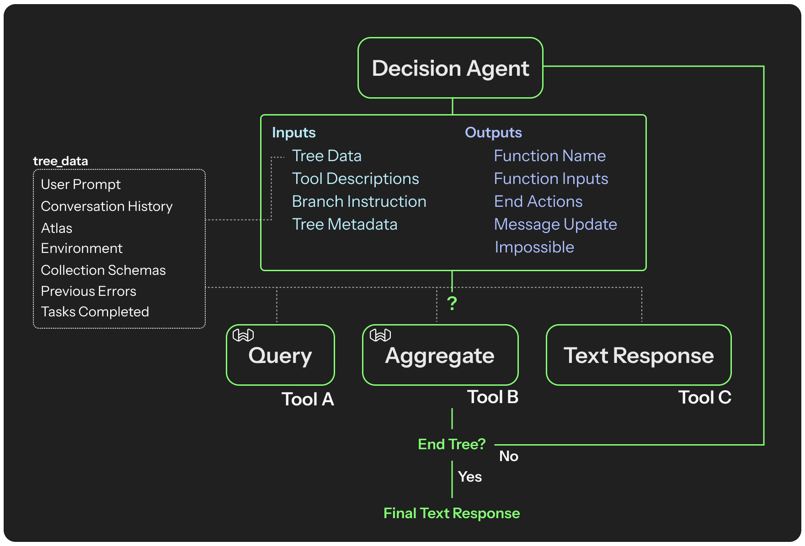

# Technical Overview

Let's break down the Elysia decision tree, how exactly it runs and how objects persist over multiple iterations. 

We will consider a 'standard' Elysia set up as an example, where we have access to two tools: 'Query' and 'Aggregate', which both interact with custom data. There are two additional tools: 'Summarize' and 'Text Response', which both provide text outputs (with slightly different specifications).

## Decision Agent

The decision agent (which is run from the `base_model`) is responsible for choosing the nodes for each decision step. This includes starting the decision process, i.e. choosing the first action to complete, as well as any other decision making variables, which we will describe.

The decision node has access to all the relevant attributes of the decision tree at a given point in time. These are given in this diagram:

{ align="center" width="75%" }

## Tree Data

The decision tree keeps record of all data used to either make a decision or call a particular tool. Essentially, the `TreeData` class should contain all information needed from the decision tree to process further actions inside of the tools or the decision making.

To see a full list of these inputs, [see the description for the `TreeData` class](../Reference/Objects.md#elysia.tree.objects.TreeData). 

