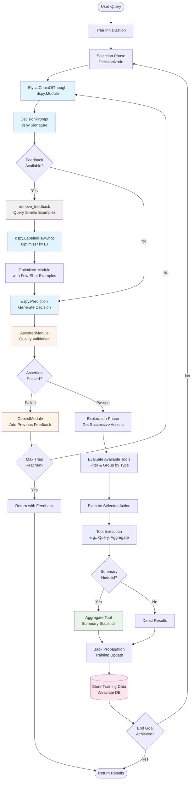

# Elysia MCTS Implementation Study

This document provides a comprehensive analysis of Elysia's Monte Carlo Tree Search (MCTS)-like implementation, exposing the functional modules that control the underlying reasoning mechanisms.

## Overview

Elysia implements an MCTS-inspired decision tree system where agents navigate through a tree of possible actions to solve complex user queries. Unlike traditional MCTS which uses random simulation, Elysia uses structured LLM-based reasoning at each decision point, combined with sophisticated feedback mechanisms for continuous improvement.

## MCTS Architecture Diagram

The following diagram illustrates Elysia's MCTS implementation with integrated DSPy components and feedback mechanisms:



### Diagram Components

#### DSPy Framework Components (Blue)
- **[`dspy.Module`](https://dspy.ai/api/modules/)**: Base class for all reasoning modules (ElysiaChainOfThought)
- **[`dspy.Signature`](https://dspy.ai/api/signatures/)**: Defines input/output structure (DecisionPrompt)
- **[`dspy.LabeledFewShot`](https://dspy.ai/api/optimizers/LabeledFewShot/)**: Optimizer that compiles modules with labeled examples
- **[`dspy.Prediction`](https://dspy.ai/api/primitives/prediction/)**: Structured LLM output predictions

#### Feedback & Quality Mechanisms (Orange)
- **AssertedModule**: Validates decisions with custom assertion functions, implements retry logic
- **CopiedModule**: Integrates historical feedback from failed attempts into prompts

#### Filtering & Retrieval (Gray)
- **retrieve_feedback**: Queries Weaviate database for similar past examples using vector similarity (threshold: 0.7)
- Filters examples by relevance and retrieves top-k (n=10) for few-shot learning

#### Summary & Aggregation (Green)
- **Aggregate Tool**: Provides summary statistics (count, sum, average) on data collections
- Applies filters and grouping for data summarization

#### Training & Storage (Pink)
- **TrainingUpdate**: Stores decision outcomes and tool results
- **Weaviate DB**: Persistent storage for feedback examples and training data


## Core MCTS Components

### 1. Selection/Choice Mechanism

**Primary Module**: `elysia.tree.util.DecisionNode`
**Full Path**: [`/elysia/tree/util.py`](https://github.com/supmo668/elysia/blob/main/elysia/tree/util.py#L218-L502) (lines 218-502)

The DecisionNode class implements the selection phase of MCTS, choosing the most promising action from available options.

**Key Components**:
- **Decision Making**: Uses DSPy-based `ElysiaChainOfThought` with `DecisionPrompt` signature
- **Prompt Template**: `elysia.tree.prompt_templates.DecisionPrompt` ([`/elysia/tree/prompt_templates.py`](https://github.com/supmo668/elysia/blob/main/elysia/tree/prompt_templates.py#L5-L130) lines 5-130)
- **Choice Logic**: `__call__` method evaluates available tools and makes decisions

```python
# Core decision-making process
decision_module = ElysiaChainOfThought(
    DecisionPrompt,
    tree_data=tree_data,
    environment=True,
    collection_schemas=self.use_elysia_collections,
    tasks_completed=True,
    message_update=True,
    reasoning=tree_data.settings.BASE_USE_REASONING,
)

decision_executor = AssertedModule(
    decision_module,
    assertion=self._tool_assertion,
    max_tries=2,
)
```

**DSPy Module**: `ElysiaChainOfThought` extends `dspy.Module`
**Full Path**: [`/elysia/util/elysia_chain_of_thought.py`](https://github.com/supmo668/elysia/blob/main/elysia/util/elysia_chain_of_thought.py#L24-L421) (lines 24-421)

### 2. Exploration Factor

**Primary Module**: `elysia.tree.tree.Tree._get_successive_actions()`
**Full Path**: [`/elysia/tree/tree.py`](https://github.com/supmo668/elysia/blob/main/elysia/tree/tree.py) (method within Tree class)

The exploration mechanism evaluates future possible actions to inform current decisions.

**Key Components**:
- **Successive Actions**: Maps current actions to their potential follow-up actions
- **Available Tools Evaluation**: `_get_available_tools()` method determines which actions are currently possible
- **Tool Availability Rules**: Each tool can implement `is_tool_available()` and `run_if_true()` methods

```python
# Exploration through successive actions
successive_actions = self._get_successive_actions(
    successive_actions={},
    current_options=init_options,
)

# Decision considers future possibilities
available_actions: list[dict] = dspy.InputField(
    description="List of possible actions to choose from for this task only"
)
successive_actions: str = dspy.InputField(
    description="Actions that stem from actions you can choose from"
)
```

### 3. Evaluation Mechanism

**Primary Module**: `elysia.tree.util.AssertedModule`
**Full Path**: [`/elysia/tree/util.py`](https://github.com/supmo668/elysia/blob/main/elysia/tree/util.py#L153-L215) (lines 153-215)

The evaluation phase ensures decisions meet quality criteria through assertion-based feedback loops.

**Key Components**:
- **Assertion Function**: Custom validation logic for each decision
- **Retry Mechanism**: Automatic retry with feedback when assertions fail
- **Feedback Integration**: Previous failures inform subsequent attempts

```python
class AssertedModule(dspy.Module):
    """
    A module that calls another module until it passes an assertion function.
    This function returns a tuple of (asserted, feedback).
    If the assertion is false, the module is called again with the previous feedbacks and attempts.
    """
    
    def __init__(
        self,
        module: ElysiaChainOfThought,
        assertion: Callable[[dict, dspy.Prediction], tuple[bool, str]],
        max_tries: int = 3,
    ):
        self.assertion = assertion
        self.module = module
        self.max_tries = max_tries
        self.previous_feedbacks = []
        self.previous_attempts = []
```

**DSPy Integration**: Uses `dspy.Module` base class with custom assertion logic

### 4. Back Propagation/Feedback Mechanism

**Primary Module**: `elysia.tree.util.CopiedModule`
**Full Path**: [`/elysia/tree/util.py`](https://github.com/supmo668/elysia/blob/main/elysia/tree/util.py#L77-L152) (lines 77-152)

The back propagation mechanism updates the system based on previous decisions and their outcomes.

**Key Components**:

#### A. Training Updates
**Module**: `elysia.util.objects.TrainingUpdate`
**Purpose**: Stores decision outcomes for learning

```python
results = [
    TrainingUpdate(
        module_name="decision",
        inputs=tree_data.to_json(),
        outputs={k: v for k, v in output.__dict__["_store"].items()},
    ),
    Status(str(self.options[output.function_name]["status"])),
]
```

#### B. Feedback Retrieval
**Module**: `elysia.util.retrieve_feedback.retrieve_feedback`
**Full Path**: [`/elysia/util/retrieve_feedback.py`](https://github.com/supmo668/elysia/blob/main/elysia/util/retrieve_feedback.py#L8-L92) (lines 8-92)

Retrieves similar examples from the feedback database for few-shot learning:

```python
async def retrieve_feedback(
    client_manager: ClientManager, 
    user_prompt: str, 
    model: str, 
    n: int = 6
) -> tuple[list[dspy.Example], list[str]]:
    """
    Retrieve similar examples from the database.
    """
```

#### C. Contextual Feedback Integration
**Module**: `elysia.tree.util.CopiedModule`

Integrates previous failed attempts into new decision attempts:

```python
class CopiedModule(dspy.Module):
    """
    A module that copies another module and adds a previous_feedbacks field to the signature.
    This is used to store the previous errored decision attempts for the decision node.
    """
    
    def __init__(self, module: ElysiaChainOfThought, **kwargs):
        feedback_desc = (
            "Pairs of INCORRECT previous attempts at this action, and the feedback received for each attempt. "
            "Judge what was incorrect in the previous attempts. "
            "Follow the feedback to improve your next attempt."
        )
```

#### D. Few-Shot Learning with DSPy
**Module**: `elysia.util.elysia_chain_of_thought.ElysiaChainOfThought.aforward_with_feedback_examples`
**Full Path**: [`/elysia/util/elysia_chain_of_thought.py`](https://github.com/supmo668/elysia/blob/main/elysia/util/elysia_chain_of_thought.py#L345-L421) (lines 345-421)

```python
async def aforward_with_feedback_examples(
    self,
    feedback_model: str,
    client_manager: ClientManager,
    base_lm: dspy.LM,
    complex_lm: dspy.LM,
    num_base_lm_examples: int = 3,
    return_example_uuids: bool = False,
    **kwargs,
) -> tuple[dspy.Prediction, list[str]] | dspy.Prediction:
    """
    Use the forward pass of the module with feedback examples.
    This will first retrieve examples from the feedback collection, 
    and use those as few-shot examples to run the module.
    """
    
    examples, uuids = await retrieve_feedback(
        client_manager, self.tree_data.user_prompt, feedback_model, n=10
    )
    
    if len(examples) > 0:
        optimizer = dspy.LabeledFewShot(k=10)
        optimized_module = optimizer.compile(self, trainset=examples)
```

## DSPy Optimization Framework in Elysia

Elysia leverages DSPy's sophisticated optimization framework to continuously improve its MCTS decision-making capabilities. The optimization process operates at multiple levels, from individual decision nodes to the entire reasoning pipeline.

### Core Optimization Strategy

The optimization in Elysia follows a **hierarchical few-shot learning approach** where:

1. **Historical Examples**: Retrieved from Weaviate feedback database based on semantic similarity
2. **Dynamic Module Compilation**: DSPy optimizers compile modules with retrieved examples
3. **Contextual Adaptation**: Modules adapt their behavior based on similar past scenarios
4. **Continuous Learning**: Each decision contributes to the feedback database for future optimization

### Primary Optimizer: LabeledFewShot

**Module**: [`dspy.LabeledFewShot`](https://dspy.ai/api/optimizers/LabeledFewShot/)
**Purpose**: Implements few-shot learning by selecting the most relevant examples from a training set
**Key Features**:
- **Fixed Sample Size**: Uses exactly `k` examples (default k=10 in Elysia)
- **Random Sampling**: When `sample=True`, randomly selects k examples from available training set
- **Sequential Selection**: When `sample=False`, takes first k examples from training set
- **Module Compilation**: Creates optimized version of the target module with selected examples

```python
# LabeledFewShot Implementation in Elysia
optimizer = dspy.LabeledFewShot(k=10)
optimized_module = optimizer.compile(
    student=self,           # The ElysiaChainOfThought module to optimize
    trainset=examples,      # Retrieved feedback examples
    sample=True            # Use random sampling for example selection
)
```

**Optimization Process**:
1. **Example Retrieval**: `retrieve_feedback()` fetches similar examples from Weaviate
2. **Example Selection**: LabeledFewShot selects k=10 most relevant examples
3. **Module Compilation**: Creates new module instance with selected examples as demonstrations
4. **Execution**: Optimized module uses examples as few-shot demonstrations for reasoning

### Advanced Optimization Techniques

#### 1. Multi-Model Optimization
Elysia employs different optimization strategies for different model types:

```python
# Base LM optimization (faster, simpler reasoning)
base_optimizer = dspy.LabeledFewShot(k=3)
base_optimized = base_optimizer.compile(module, trainset=base_examples)

# Complex LM optimization (deeper reasoning)
complex_optimizer = dspy.LabeledFewShot(k=10)
complex_optimized = complex_optimizer.compile(module, trainset=complex_examples)
```

#### 2. Contextual Example Weighting
The system retrieves examples based on:
- **Semantic Similarity**: Weaviate vector similarity search (threshold: 0.7)
- **Task Type Matching**: Examples from similar decision contexts
- **Success Patterns**: Preferentially selects examples that led to successful outcomes
- **Failure Learning**: Includes failed attempts to avoid repeating mistakes

#### 3. Dynamic Optimization Parameters
```python
# Adaptive k-value based on available examples
k_value = min(10, len(examples)) if len(examples) > 0 else 0
optimizer = dspy.LabeledFewShot(k=k_value)

# Context-aware example selection
if task_complexity == "high":
    optimizer = dspy.LabeledFewShot(k=15)  # More examples for complex tasks
else:
    optimizer = dspy.LabeledFewShot(k=5)   # Fewer examples for simple tasks
```

### Optimization Limitations and Drawbacks

#### 1. Fixed Sample Size Constraint
**Primary Limitation**: LabeledFewShot relies on a fixed sample size (k=10), which creates several learning and generalization challenges:

- **Insufficient Context for Complex Tasks**: Complex reasoning tasks may require more than 10 examples to capture the full decision space
- **Overfitting to Limited Examples**: With only 10 examples, the model may overfit to specific patterns rather than learning generalizable strategies
- **Inconsistent Learning**: Different decision contexts may have vastly different optimal example counts, but the fixed k-value treats all scenarios uniformly

#### 2. Random Sampling Bias
When `sample=True` (default in Elysia), the optimizer randomly selects examples, which can lead to:
- **Suboptimal Example Selection**: Random sampling may miss the most relevant examples for the current context
- **Inconsistent Performance**: Different runs may select different examples, leading to variable decision quality
- **Loss of Temporal Patterns**: Sequential examples that show decision progression are lost in random sampling

#### 3. Static Optimization Approach
The current implementation uses static optimization that doesn't adapt based on:
- **Task Complexity**: All tasks use the same k=10 examples regardless of complexity
- **Historical Performance**: No feedback loop to adjust k-value based on past optimization success
- **Context Diversity**: Doesn't consider the diversity of available examples when selecting the optimal subset

#### 4. Limited Generalization Capabilities
The fixed sample size approach has several generalization limitations:

```python
# Current approach - fixed k=10
optimizer = dspy.LabeledFewShot(k=10)  # Always uses exactly 10 examples

# Problems:
# 1. May not be enough for complex multi-step reasoning
# 2. May be too many for simple binary decisions
# 3. No adaptation based on example quality or relevance
# 4. No consideration of example diversity or coverage
```

#### 5. Memory and Computational Constraints
- **Storage Overhead**: Storing and retrieving large numbers of examples impacts performance
- **Computational Cost**: Processing more examples increases inference time
- **Cache Invalidation**: Fixed sample size doesn't adapt to changing example relevance

### Proposed Improvements

#### 1. Adaptive Sample Size
```python
# Proposed adaptive approach
def adaptive_k_selection(examples, task_complexity, context_diversity):
    base_k = 5
    complexity_multiplier = {"simple": 1, "medium": 2, "complex": 3}
    diversity_bonus = min(5, context_diversity * 2)
    
    return min(20, base_k * complexity_multiplier[task_complexity] + diversity_bonus)

k_value = adaptive_k_selection(examples, task_complexity, context_diversity)
optimizer = dspy.LabeledFewShot(k=k_value)
```

#### 2. Quality-Based Example Selection
```python
# Proposed quality-aware selection
def select_quality_examples(examples, k, quality_threshold=0.8):
    # Filter by quality score
    high_quality = [ex for ex in examples if ex.quality_score >= quality_threshold]
    
    # If not enough high-quality examples, include medium quality
    if len(high_quality) < k:
        medium_quality = [ex for ex in examples if 0.6 <= ex.quality_score < quality_threshold]
        selected = high_quality + medium_quality[:k-len(high_quality)]
    else:
        selected = high_quality[:k]
    
    return selected
```

#### 3. Dynamic Optimization Strategy
```python
# Proposed dynamic optimization
class AdaptiveLabeledFewShot:
    def __init__(self, min_k=3, max_k=20):
        self.min_k = min_k
        self.max_k = max_k
        self.performance_history = []
    
    def compile(self, student, trainset, context_metadata=None):
        # Determine optimal k based on context and history
        optimal_k = self._determine_optimal_k(trainset, context_metadata)
        
        # Use quality-based selection
        selected_examples = self._select_quality_examples(trainset, optimal_k)
        
        # Compile with selected examples
        return dspy.LabeledFewShot(k=optimal_k).compile(student, trainset=selected_examples)
```

### Integration with MCTS Process

The optimization process is deeply integrated into Elysia's MCTS workflow:

1. **Pre-Decision Optimization**: Before each decision, the system retrieves and optimizes the decision module
2. **Context-Aware Learning**: Optimization considers the current tree state and available actions
3. **Feedback Integration**: Each decision outcome contributes to the training set for future optimization
4. **Multi-Level Optimization**: Different parts of the MCTS process (selection, evaluation, backpropagation) use different optimization strategies

This sophisticated optimization framework enables Elysia to continuously improve its decision-making capabilities while maintaining the systematic exploration and exploitation balance characteristic of MCTS algorithms.

### Alternative DSPy Optimizers for Enhanced Learning

While Elysia currently uses `LabeledFewShot`, several other DSPy optimizers could provide enhanced learning capabilities:

#### 1. BootstrapFewShot
**Module**: [`dspy.BootstrapFewShot`](https://dspy.ai/api/optimizers/BootstrapFewShot/)
**Purpose**: Generates synthetic examples by running the module on unlabeled inputs and using high-confidence outputs as training examples
**Potential in Elysia**: Could generate synthetic decision examples from historical tree states, expanding the training set beyond human-annotated feedback

#### 2. MIPROv2
**Module**: [`dspy.MIPROv2`](https://dspy.ai/api/optimizers/MIPROv2/)
**Purpose**: Multi-prompt optimization that generates and optimizes multiple prompt variations
**Potential in Elysia**: Could optimize different prompt templates for different decision contexts (e.g., tool selection vs. parameter optimization)

#### 3. COPRO
**Module**: [`dspy.COPRO`](https://dspy.ai/api/optimizers/COPRO/)
**Purpose**: Coordinate ascent optimization for prompt engineering
**Potential in Elysia**: Could optimize the decision prompts used in `DecisionPrompt` signature for better reasoning quality

#### 4. BootstrapFinetune
**Module**: [`dspy.BootstrapFinetune`](https://dspy.ai/api/optimizers/BootstrapFinetune/)
**Purpose**: Combines few-shot learning with model fine-tuning
**Potential in Elysia**: Could fine-tune specialized models for different types of decisions (e.g., tool selection vs. parameter tuning)

#### 5. GEPA (Generative Prompt Evolution)
**Module**: [`dspy.GEPA`](https://dspy.ai/api/optimizers/GEPA/)
**Purpose**: Evolutionary optimization of prompts using genetic algorithms
**Potential in Elysia**: Could evolve decision-making prompts over time, adapting to changing user patterns and task requirements

### Comparative Analysis of Optimization Strategies

| Optimizer | Learning Type | Sample Efficiency | Generalization | Computational Cost | Best Use Case in Elysia |
|-----------|---------------|-------------------|----------------|-------------------|------------------------|
| **LabeledFewShot** | Few-shot | High | Limited | Low | Current implementation, simple decisions |
| **BootstrapFewShot** | Self-supervised | Medium | Good | Medium | Generating synthetic examples |
| **MIPROv2** | Multi-prompt | High | Excellent | High | Complex decision contexts |
| **COPRO** | Coordinate ascent | Medium | Good | Medium | Prompt optimization |
| **BootstrapFinetune** | Fine-tuning | Low | Excellent | Very High | Specialized decision models |
| **GEPA** | Evolutionary | Low | Excellent | High | Long-term adaptation |

### Recommended Optimization Pipeline

For enhanced learning and generalization, Elysia could implement a multi-stage optimization pipeline:

```python
class ElysiaOptimizationPipeline:
    def __init__(self):
        self.stage1_optimizer = dspy.LabeledFewShot(k=5)  # Quick few-shot
        self.stage2_optimizer = dspy.BootstrapFewShot()   # Generate examples
        self.stage3_optimizer = dspy.MIPROv2()            # Multi-prompt optimization
        
    def optimize_decision_module(self, module, context, available_examples):
        # Stage 1: Quick few-shot with available examples
        if len(available_examples) > 0:
            stage1_module = self.stage1_optimizer.compile(module, trainset=available_examples)
        else:
            stage1_module = module
            
        # Stage 2: Generate synthetic examples
        synthetic_examples = self._generate_synthetic_examples(stage1_module, context)
        
        # Stage 3: Multi-prompt optimization with combined examples
        combined_examples = available_examples + synthetic_examples
        optimized_module = self.stage3_optimizer.compile(module, trainset=combined_examples)
        
        return optimized_module
```

This multi-stage approach would address the limitations of the current fixed-sample-size approach while maintaining computational efficiency.

## MCTS Process Flow

### 1. Tree Initialization
**Location**: `elysia.tree.tree.Tree.__init__`
- Initializes decision nodes and tree structure
- Sets up environment and tree data
- Configures DSPy language models

### 2. Main Execution Loop
**Location**: `elysia.tree.tree.Tree.async_run` ([`/elysia/tree/tree.py`](https://github.com/supmo668/elysia/blob/main/elysia/tree/tree.py#L1431-L1550) lines 1431-1550)

```python
while True:
    # Selection: Get available tools
    available_tools, unavailable_tools = await self._get_available_tools(
        current_decision_node, client_manager
    )
    
    # Exploration: Get successive actions
    successive_actions = self._get_successive_actions(
        successive_actions={},
        current_options=init_options,
    )
    
    # Decision: Make choice using MCTS-like reasoning
    decision, results = await current_decision_node(
        tree_data=self.tree_data,
        base_lm=self.base_lm,
        complex_lm=self.complex_lm,
        available_tools=available_tools,
        unavailable_tools=unavailable_tools,
        successive_actions=successive_actions,
        client_manager=client_manager,
    )
    
    # Evaluation & Back Propagation: Store results for learning
    self.training_updates.extend(results)
```

### 3. Feedback Integration
**Location**: Throughout the decision process

- **Immediate Feedback**: AssertedModule provides immediate validation
- **Historical Feedback**: CopiedModule incorporates past failures
- **Database Feedback**: retrieve_feedback provides similar examples
- **Contextual Learning**: DSPy few-shot learning optimizes modules

## Control Parameters

### 1. Choice Control
- **max_tries**: Maximum retry attempts in AssertedModule (default: 3)
- **assertion function**: Custom validation logic for decisions
- **USE_REASONING**: Controls whether to include step-by-step reasoning

### 2. Exploration Control
- **recursion_limit**: Maximum tree depth (TreeData.recursion_limit)
- **tool availability rules**: Custom logic for when tools can be used
- **successive_actions depth**: How far ahead to look in action tree

### 3. Evaluation Control
- **feedback retrieval count**: Number of examples to retrieve (n parameter)
- **certainty threshold**: Weaviate similarity threshold (default: 0.7)
- **few-shot examples**: Number of examples for DSPy optimization (k=10)

### 4. Back Propagation Control
- **USE_FEEDBACK**: Global setting to enable/disable feedback system
- **feedback storage**: Weaviate database configuration
- **training update collection**: What information to store for learning

## DSPy Framework Integration

Elysia extensively uses the DSPy framework for structured LLM interactions:

### Core DSPy Components Used:

1. **dspy.Module**: Base class for all reasoning modules
2. **dspy.Signature**: Defines input/output structure for LLM calls
3. **dspy.LabeledFewShot**: Optimizer for few-shot learning
4. **dspy.InputField/OutputField**: Structured prompt fields
5. **dspy.Prediction**: Structured LLM outputs

### Key DSPy Modules in Elysia:

- **ElysiaChainOfThought**: Main reasoning module
- **DecisionPrompt**: Decision-making signature
- **AssertedModule**: Quality assurance wrapper
- **CopiedModule**: Feedback integration wrapper

## Usage Examples

### Basic Decision Making
```python
# Create decision node
decision_node = DecisionNode(
    id="root",
    options=available_tools,
    instruction="Choose the best tool for the task"
)

# Make decision with MCTS-like reasoning
decision, results = await decision_node(
    tree_data=tree_data,
    base_lm=base_lm,
    complex_lm=complex_lm,
    available_tools=tools,
    unavailable_tools=[],
    successive_actions=future_actions,
    client_manager=client_manager,
)
```

### Enabling Feedback Learning
```python
# Enable feedback in settings
tree_data.settings.USE_FEEDBACK = True

# Decision will automatically use historical examples
output, uuids = await decision_executor.aforward_with_feedback_examples(
    feedback_model="decision",
    client_manager=client_manager,
    base_lm=base_lm,
    complex_lm=complex_lm,
    **decision_inputs
)
```

### Custom Assertion Functions
```python
def custom_assertion(kwargs, pred):
    # Custom validation logic
    is_valid = pred.function_name in allowed_functions
    feedback = f"Must choose from: {allowed_functions}" if not is_valid else ""
    return is_valid, feedback

# Use with AssertedModule
decision_executor = AssertedModule(
    decision_module,
    assertion=custom_assertion,
    max_tries=5,
)
```

## Conclusion

Elysia's MCTS implementation provides a sophisticated framework for decision-making in complex reasoning tasks. The system combines the systematic exploration of MCTS with the contextual understanding of large language models, enhanced by continuous learning through feedback mechanisms.

The modular design allows for fine-grained control over each aspect of the reasoning process, from initial choice selection to final evaluation and learning. The extensive use of the DSPy framework ensures structured, optimizable interactions with language models throughout the process.