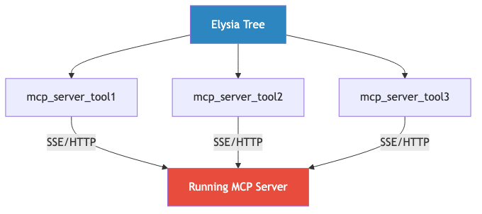

# MCP Implementation Details

Comprehensive technical documentation for MCP integration with Elysia.

## Architecture Overview

### MCP_AS_AGENT Modes


#### Agent Mode (`MCP_AS_AGENT=True`)
One agent tool per MCP server. Accepts natural language, uses ReAct agent.


**Usage:**
```python
tree("Search for ML papers and analyze sentiment")
```

#### Individual Mode (`MCP_AS_AGENT=False`)
One Elysia tool per MCP server tool. Structured inputs, direct execution.



**Usage:**
```python
tree.tools["mcp_server_search"](inputs={"query": "ML papers"})
```

## Connection Architecture

### SSE/HTTP Transport


**Configuration:**
```json
{
  "servers": [{
    "name": "api_server",
    "url": "http://localhost:8080/mcp",
    "headers": {"Authorization": "Bearer token"},
    "enabled": true
  }]
}
```

## Tool Discovery & Loading

### Automatic Tool Discovery


### Files Modified

1. **`elysia/tools/mcp/mcp_tool.py`**
   - SSE/HTTP transport only
   - Agent mode: Natural language → ReAct agent
   - Gateway mode: action/tool_name/tool_inputs

2. **`elysia/tools/mcp/mcp_loader.py`**
   - Reads `mcp.json`
   - Creates tool classes based on `MCP_AS_AGENT`
   - Auto-exports for discovery

3. **`elysia/tools/ui/default_tools.py`**
   - Auto-discovers MCP tools (prefix: `MCP_`)
   - Adds to root branch during tree init

## Parameter Surfacing

### Agent Mode

**Input:**
```python
{"query": "Natural language task"}
```

**Flow:**
1. MCPTool receives query
2. ReAct agent plans execution
3. Agent selects appropriate MCP tools
4. Returns combined result

### Gateway Mode  

**Input:**
```python
{
    "action": "list" | "execute",
    "tool_name": "tool_name",  # if execute
    "tool_inputs": {...}        # if execute
}
```

**Flow:**
1. `action='list'`: Returns available tools
2. `action='execute'`: Runs specific tool with inputs

### Individual Mode

**Input:** Tool-specific schema
```python
{"param1": "value1", "param2": "value2"}
```

**Flow:**
1. Direct connection to MCP server
2. Execute specific tool
3. Return result

## Execution Examples

### Agent Mode
```python
# Natural language query
result = tree("Search API documentation for authentication methods")

# Agent will:
# 1. Call MCP 'search' tool with query
# 2. Analyze results
# 3. Return summary
```

### Gateway Mode
```python
# List available tools
result = tree.tools["mcp_api_server"]({"action": "list"})

# Execute specific tool
result = tree.tools["mcp_api_server"]({
    "action": "execute",
    "tool_name": "search",
    "tool_inputs": {"query": "authentication"}
})
```

### Individual Mode
```python
# Direct tool execution
result = tree.tools["mcp_api_server_search"]({
    "query": "authentication",
    "limit": 10
})
```

## Configuration

### mcp.json Schema
```json
{
  "servers": [
    {
      "name": "api_server",
      "description": "API documentation server",
      "url": "http://localhost:8080/mcp",
      "headers": {
        "Authorization": "Bearer ${API_TOKEN}",
        "Content-Type": "application/json"
      },
      "enabled": true
    }
  ]
}
```

### Environment Variables
```bash
# Control operating mode
MCP_AS_AGENT=True  # or False

# Model configuration (for agent mode)
BASE_MODEL=gpt-4o-mini
OPENAI_API_KEY=sk-...

# Optional: API tokens for MCP servers
API_TOKEN=your_token_here
```

## Benefits

### SSE/HTTP Transport
✅ No local server management  
✅ Connect to pre-running services  
✅ Scalable architecture  
✅ Standard HTTP authentication  
✅ Network-accessible  

### Agent Mode
✅ Natural language interface  
✅ Autonomous execution  
✅ Multi-step reasoning  
✅ Flexible tool usage  

### Individual Mode
✅ Direct control  
✅ Predictable behavior  
✅ Lower latency  
✅ Fine-grained error handling  

## Testing

```python
# Test MCP connection
from elysia.tools.mcp.mcp_tool import MCPTool

tool = MCPTool(
    server_name="test",
    url="http://localhost:8080/mcp"
)

success = await tool.initialize()
assert success
assert len(tool._langchain_tools) > 0
```

## Troubleshooting

| Issue | Solution |
|-------|----------|
| Connection failed | Check MCP server is running at URL |
| No tools found | Verify server returns tools on connection |
| Agent errors | Check BASE_MODEL and OPENAI_API_KEY |
| Import errors | `pip install langchain langchain-openai langchain-mcp-adapters` |

## Summary

- **Transport**: SSE/HTTP only (assumes running servers)
- **Modes**: Agent (natural language) or Individual (structured)
- **Discovery**: Automatic tool loading from mcp.json
- **Configuration**: Simple JSON + environment variables

---

**Status**: Production Ready ✅
