# MCP Implementation Details

This document provides comprehensive implementation information for the MCP integration, including architecture, interaction models, and technical details.

## MCP Tool Interaction Model

### Architecture Decision: MCP Server as Gateway Tool

**Key Concept**: Each `MCPTool` instance represents **one MCP server** that acts as a **gateway** to multiple underlying tools.

**Design Pattern**: Gateway + Two-Phase Execution
- **Phase 1**: Discovery - List available tools from the MCP server
- **Phase 2**: Execution - Execute a specific tool by name

**NOT**: Each MCP server tool as a separate Elysia Tool
**YES**: One Elysia Tool per MCP server, exposing multiple tools via actions

### Interaction Flow


### Parameter Surfacing Model


### Why This Design?

**Advantages of Gateway Pattern:**

1. **Single Tool Registration**: One MCPTool per server instead of N separate tools
2. **Dynamic Discovery**: Tools can change without code regeneration
3. **Lazy Loading**: Connect to MCP server only when first used
4. **Unified Management**: Single point for monitoring, logging, error handling
5. **Tool Metadata Access**: Agent can query available tools before execution

**Alternative Rejected: Individual Tool Wrapping**
```python
# ❌ NOT IMPLEMENTED: Each MCP tool as separate Elysia tool
tree.add_tool(MCPSearchTool())      # Would need separate class
tree.add_tool(MCPAnalyzeTool())     # Would need separate class
tree.add_tool(MCPSummarizeTool())   # Would need separate class

# ✅ IMPLEMENTED: Gateway pattern
tree.add_tool(MCPTool(server_name="api_ai_mcp"))  # One tool, multiple capabilities
```

## Changes Summary

### Quick Summary

**Problem**: MCP tools from `mcp.json` were not visible in the tree structure sent to the frontend.

**Solution**: Enhanced tool discovery to include MCP tools and auto-load them during tree initialization.

**Result**: MCP tools now automatically appear in the tree structure and are visible in the UI.

---

## Tool Discovery & Loading Flow

### Before Fix (Tools Not Visible)

```
┌─────────────────────────────────────────────────────────────────┐
│ Application Startup                                             │
└─────────────────────────────────────────────────────────────────┘
                            │
                            ▼
┌─────────────────────────────────────────────────────────────────┐
│ elysia/tools/mcp/mcp_loader.py                                  │
│ - Reads mcp.json                                                │
│ - Creates MCP_api_ai_mcp class                                  │
│ - Exports to module namespace                                   │
└─────────────────────────────────────────────────────────────────┘
                            │
                            ▼
┌─────────────────────────────────────────────────────────────────┐
│ Tree Initialization: Tree(branch_initialisation="one_branch")   │
└─────────────────────────────────────────────────────────────────┘
                            │
                            ▼
┌─────────────────────────────────────────────────────────────────┐
│ set_branch_initialisation("one_branch")                         │
│   └─> load_default_tools_for_mode()                            │
│       └─> Adds: Query, Aggregate, Visualise, etc.              │
└─────────────────────────────────────────────────────────────────┘
                            │
                            ▼
┌─────────────────────────────────────────────────────────────────┐
│ _load_additional_discovered_tools()                             │
│   └─> discover_tools_from_module()                             │
│       └─> Only searches: elysia.api.custom_tools               │
│           ❌ DOES NOT FIND MCP tools!                           │
└─────────────────────────────────────────────────────────────────┘
                            │
                            ▼
┌─────────────────────────────────────────────────────────────────┐
│ tree.tree structure                                             │
│ {                                                               │
│   "base": {                                                     │
│     "options": {                                                │
│       "query": {...},                                           │
│       "aggregate": {...}                                        │
│       ❌ NO MCP TOOLS                                           │
│     }                                                           │
│   }                                                             │
│ }                                                               │
└─────────────────────────────────────────────────────────────────┘
                            │
                            ▼
┌─────────────────────────────────────────────────────────────────┐
│ Frontend: GET /tree/{user_id}/{conversation_id}                 │
│   └─> Receives tree.tree                                       │
│       └─> MCP tools NOT VISIBLE in UI ❌                        │
└─────────────────────────────────────────────────────────────────┘
## Tool Discovery & Loading Flow

### Before Fix (Tools Not Visible)



```mermaid
flowchart TD
    Start([Application Startup]) --> LoadMCP[elysia/tools/mcp/mcp_loader.py<br/>Reads mcp.json<br/>Creates MCP classes]
    LoadMCP --> TreeInit[Tree Initialization<br/>branch_initialisation='one_branch']
    TreeInit --> SetBranch[set_branch_initialisation]
    SetBranch --> LoadDefault[load_default_tools_for_mode<br/>Adds: Query, Aggregate, etc.]
    LoadDefault --> DiscoverAdditional[_load_additional_discovered_tools]
    DiscoverAdditional --> SearchCustom[discover_tools_from_module<br/>Only searches: elysia.api.custom_tools]
    SearchCustom --> NoMCP[❌ DOES NOT FIND MCP tools!]
    NoMCP --> BuildTree[tree.tree structure<br/>NO MCP TOOLS]
    BuildTree --> Frontend[Frontend GET /tree/user/conversation<br/>❌ MCP tools NOT VISIBLE]
    
    style NoMCP fill:#ffcccc,stroke:#cc0000
    style Frontend fill:#ffcccc,stroke:#cc0000
    style BuildTree fill:#ffeecc,stroke:#cc6600
```

### After Fix (Tools Visible)

```mermaid
flowchart TD
    Start([Application Startup]) --> LoadMCP[elysia/tools/mcp/mcp_loader.py<br/>Reads mcp.json<br/>Creates MCP classes]
    LoadMCP --> TreeInit[Tree Initialization<br/>branch_initialisation='one_branch']
    TreeInit --> SetBranch[set_branch_initialisation]
    SetBranch --> LoadDefault[load_default_tools_for_mode ✨<br/>Adds: Query, Aggregate, etc.]
    LoadDefault --> AutoDiscover[🆕 Auto-discover MCP tools]
    AutoDiscover --> SearchMCP[discover_tools_from_module<br/>Searches: elysia.tools.mcp.mcp_loader]
    SearchMCP --> FoundMCP[✅ FINDS: MCP_api_ai_mcp]
    FoundMCP --> AddTool[tree.add_tool MCP_api_ai_mcp]
    AddTool --> UpdateNode[tree.decision_nodes base.options<br/>mcp_api_ai_mcp added]
    UpdateNode --> BuildTree[tree._construct_tree<br/>MCP TOOLS IN STRUCTURE]
    BuildTree --> Frontend[Frontend GET /tree/user/conversation<br/>✅ MCP tools VISIBLE in UI]
    
    style FoundMCP fill:#ccffcc,stroke:#00cc00
    style Frontend fill:#ccffcc,stroke:#00cc00
    style BuildTree fill:#eeffcc,stroke:#66cc00
    style AutoDiscover fill:#cceeff,stroke:#0066cc
```



## MCPTool Input/Output Contract

### Tool Definition (What Agent Sees)


### Input Schema Surfacing

The agent receives this schema in `DecisionPrompt.available_actions`:

```python
{
    "name": "mcp_api_ai_mcp",
    "description": "MCP server 'api-ai-mcp' (stdio) - provides access to multiple tools",
    "inputs": {
        "action": {
            "description": "Action: 'list' to show tools, 'execute' to run a specific tool",
            "type": "<class 'str'>",
            "default": "list"
        },
        "tool_name": {
            "description": "Name of the tool to execute (required when action='execute')",
            "type": "<class 'str'>",
            "required": False
        },
        "tool_inputs": {
            "description": "Inputs for the tool (required when action='execute')",
            "type": "<class 'dict'>",
            "required": False,
            "default": {}
        }
    }
}
```

### Execution Patterns

#### Pattern 1: Discovery First


#### Pattern 2: Direct Execution


## Parameter Flow: From Configuration to Execution


## Two-Phase Parameter Surfacing

### Phase 1: MCPTool Parameters (Elysia Level)

These are **always** visible to the agent in `available_actions`:

```python

## Two-Phase Parameter Surfacing

### Phase 1: MCPTool Parameters (Elysia Level)

These are **always** visible to the agent in `available_actions`:

```python
{
    "action": "list" | "execute",      # What to do with the MCP server
    "tool_name": "optional_string",    # Which MCP tool to run (if execute)
    "tool_inputs": {"key": "value"}    # Inputs for that specific tool
}
```

### Phase 2: MCP Tool Parameters (MCP Server Level)

These are **discovered dynamically** when `action='list'`:

```python
# Agent calls: MCPTool(action='list')
# Returns:
[
    {
        "name": "search",
        "description": "Search documents",
        "inputs": {
            "query": "string",
            "limit": "int"
        }
    },
    {
        "name": "analyze",
        "description": "Analyze sentiment",
        "inputs": {
            "text": "string"
        }
    }
]
```

Then agent uses this info to call:
```python
MCPTool(
    action='execute',
    tool_name='search',
    tool_inputs={'query': 'ML papers', 'limit': 10}
)
```

## Real-World Execution Example

### Complete Flow with Parameter Surfacing


## Architecture Comparison

### Design Choice: Why Gateway Pattern?


### 1. `elysia/util/tool_discovery.py`

**Function Modified**: `discover_tools_from_module()`

**Changes**:
- Added import of `elysia.tools.mcp.mcp_loader`
- Added logic to discover MCP tool classes from the mcp_loader module
- Filters for Tool subclasses with names starting with `MCP_`

**Impact**: MCP tools are now discovered alongside custom tools

### 2. `elysia/tools/ui/default_tools.py`

**Function Modified**: `load_default_tools_for_mode()`

**Changes**:
- Added auto-discovery of MCP tools after loading default tools
- Automatically adds discovered MCP tools to the root branch
- Logs successful and failed MCP tool additions

**Impact**: MCP tools are automatically added to every tree initialization

### 3. `elysia/tree/tree.py`

**Method Modified**: `_load_additional_discovered_tools()`

**Changes**:
- Removed duplicate MCP loading logic
- Converted to empty stub with deprecation notice
- Kept for backwards compatibility

**Impact**: Eliminates duplicate code; all MCP loading now centralized

## Transport Types Support

### Transport Architecture


### Stdio Transport (Local MCP Server)
```python
tool = MCPTool(
    server_name="my_server",
    transport_type="stdio",
    server_script_path="/path/to/server.py"
)
```

**Use Case**: Local development, custom scripts, file system tools

### SSE Transport (Remote MCP Server)
```python
tool = MCPTool(
    server_name="api_server",
    transport_type="sse",
    url="http://localhost:8080/mcp",
    headers={"Authorization": "Bearer token"}
)
```

**Use Case**: API integrations, cloud services, remote tools

## Configuration Schema

### Stdio Transport Configuration
```json
{
  "name": "server_name",
  "description": "Server description",
  "type": "stdio",
  "server_script_path": "/path/to/script.py",
  "enabled": true
}
```

### SSE Transport Configuration
```json
{
  "name": "server_name",
  "description": "Server description",
  "type": "sse",
  "url": "http://host:port/path",
  "headers": {
    "Authorization": "Bearer token",
    "Custom-Header": "value"
  },
  "inputs": [
    {
      "type": "promptString",
      "id": "token_id",
      "description": "Token description",
      "password": true
    }
  ],
  "enabled": true
}
```

## Testing Checklist

- [x] MCP tools are discovered by `discover_tools_from_module()`
- [x] MCP tools are added to tree during initialization
- [x] MCP tools appear in `tree.tools` dictionary
- [x] MCP tools appear in `tree.decision_nodes[root].options`
- [x] MCP tools appear in `tree.tree` structure (what frontend sees)
- [x] Tool deduplication (`tools.py` uses `tool_discovery.py`)
- [x] Stdio transport support (local MCP servers)
- [x] SSE transport support (remote MCP servers)
- [x] Backwards compatibility maintained

## Summary: How MCPTool Works

### Key Points

1. **One Tool Per Server**: Each `MCPTool` instance = one MCP server gateway
2. **Two-Phase Operation**: 
   - `action='list'`: Discover available tools
   - `action='execute'`: Run a specific tool
3. **Dynamic Discovery**: Tools are discovered at runtime, no code generation
4. **Gateway Pattern**: Agent interacts with ONE tool that proxies to many MCP tools
5. **Parameter Surfacing**: 
   - **Elysia Level**: action, tool_name, tool_inputs (always visible)
   - **MCP Level**: Each tool's specific parameters (discovered dynamically)

### Agent's View

```python
# The agent sees this in available_actions:
{
    "name": "mcp_api_ai_mcp",
    "description": "MCP server providing multiple tools",
    "inputs": {
        "action": "list or execute",
        "tool_name": "string (optional)",
        "tool_inputs": "dict (optional)"
    }
}

# Agent can:
# 1. List tools: MCPTool(action='list')
# 2. Execute tool: MCPTool(action='execute', tool_name='search', tool_inputs={...})
```

### Developer's View

```python
# Configuration (mcp.json)
{
    "name": "my_server",
    "type": "stdio",
    "server_script_path": "/path/to/server.py"
}

# Results in MCPTool class creation
class MCP_my_server(MCPTool):
    def __init__(self):
        super().__init__(
            server_name="my_server",
            transport_type="stdio",
            server_script_path="/path/to/server.py"
        )

# Automatically discovered and added to tree
# Agent can now use it without any manual registration
```

### Execution Flow Summary


## Key Benefits

1. **Automatic Discovery**: MCP tools are automatically discovered and added to trees
2. **No Manual Configuration**: No need to manually add MCP tools to tree branches
3. **Consistent Behavior**: All tree initialization modes get MCP tools automatically
4. **Frontend Visibility**: MCP tools now visible in UI for user selection
5. **Centralized Logic**: All tool loading logic in one place (`default_tools.py`)
6. **Multiple Transports**: Support for both local (stdio) and remote (SSE) MCP servers
7. **Type Safety**: Strong typing with Literal types for transport validation
8. **Extensibility**: Easy to add new transport types
9. **Gateway Pattern**: One tool per server, not N tools per server
10. **Dynamic Capabilities**: Tools discovered at runtime, adapts to server changes

## Future Enhancements

Potential improvements for future consideration:

1. **Selective Loading**: Allow configuration to specify which MCP tools to load
2. **Branch Placement**: Allow MCP tools to be added to specific branches, not just root
3. **Tool Ordering**: Control the order in which MCP tools appear in the tree
4. **Dynamic Reloading**: Hot-reload MCP tools when `mcp.json` changes
5. **Tool Metadata**: Extract and display MCP tool capabilities in UI
6. **Health Checks**: Monitor MCP server availability
7. **Failover**: Support fallback servers for high availability

---

**Implementation Status: Complete and Production-Ready** ✅


