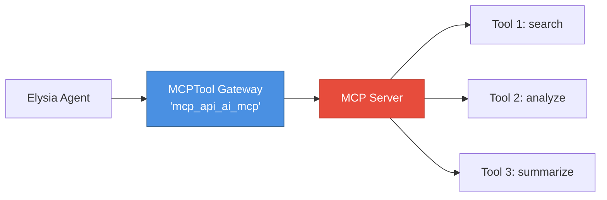
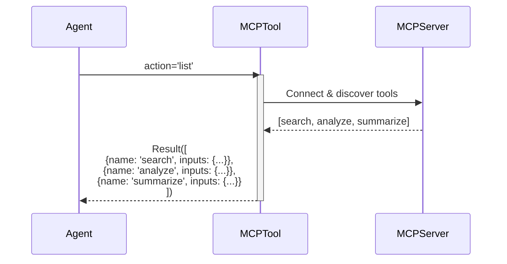
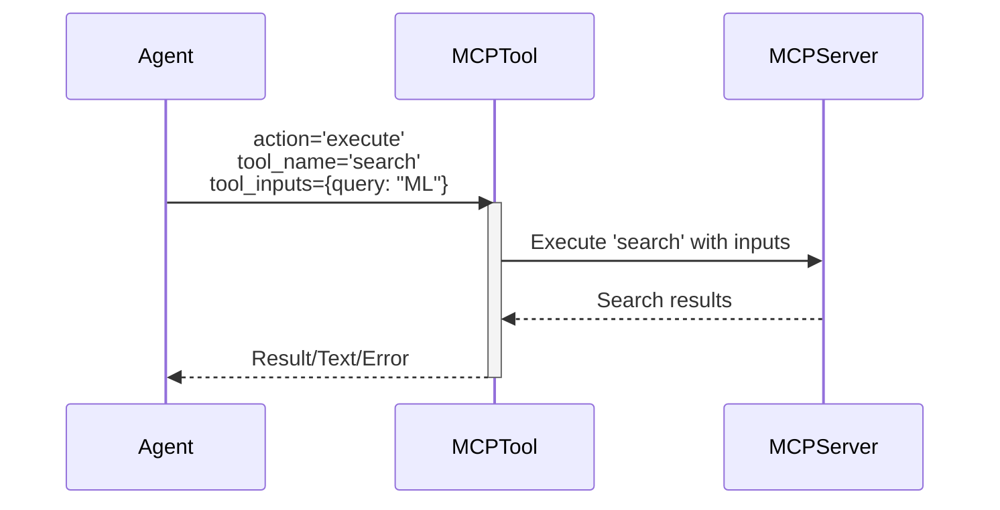
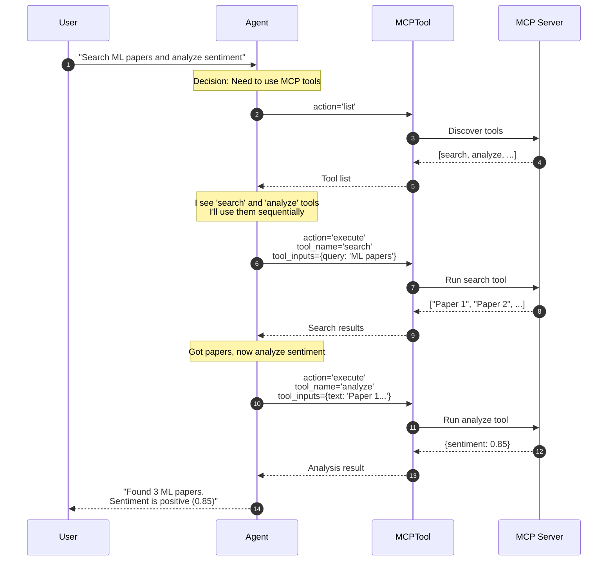
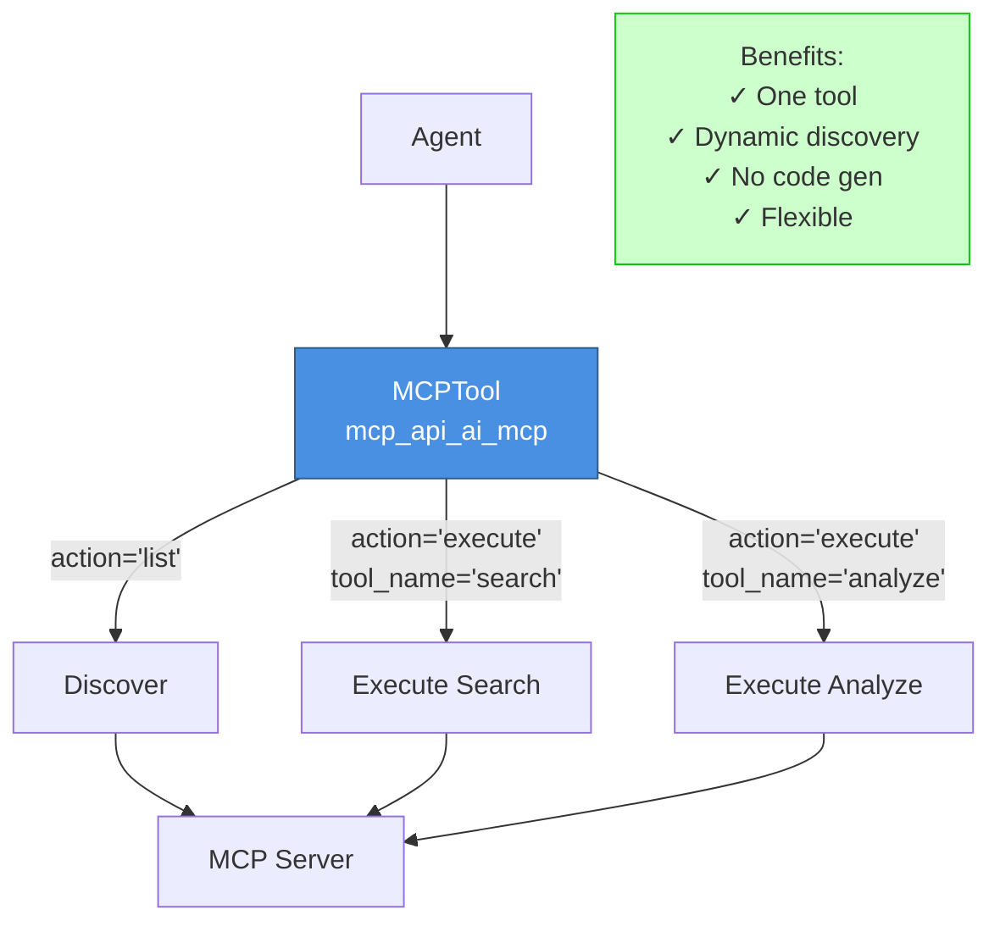
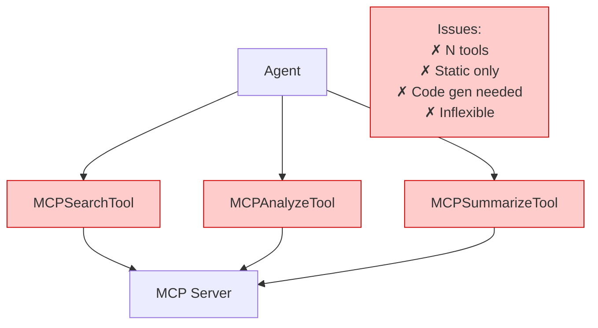

# MCP Tool Interaction Model

## Overview

This document explains how MCPTool works, how parameters are surfaced, and the design decision to use MCP servers as gateway tools rather than individual tool wrappers.

## Core Design: Gateway Pattern

### One MCPTool = One MCP Server

**Key Concept**: Each `MCPTool` instance represents **one MCP server** that provides access to **multiple tools**.



**NOT**: Each MCP server tool as separate Elysia Tool ❌
**YES**: One Elysia Tool per MCP server ✅

## Why Gateway Pattern?

### Rejected Alternative: Individual Tool Wrapping

```python
# ❌ This approach was NOT implemented
class MCPSearchTool(Tool):
    """Separate Elysia tool for MCP search"""
    pass

class MCPAnalyzeTool(Tool):
    """Separate Elysia tool for MCP analyze"""
    pass

tree.add_tool(MCPSearchTool())   # Need separate class for each
tree.add_tool(MCPAnalyzeTool())  # Need separate class for each
# ... repeat for every MCP tool
```

**Problems with this approach:**
1. Need to create N Elysia tool classes for N MCP tools
2. Code generation required when MCP tools change
3. Duplicate connection/initialization logic for each tool
4. No dynamic discovery - tools hardcoded at build time
5. Changes to MCP server require code regeneration

### Implemented: Gateway Pattern

```python
# ✅ Implemented approach
class MCPTool(Tool):
    """Single gateway to all tools in an MCP server"""
    
    def __call__(self, inputs):
        action = inputs['action']
        
        if action == 'list':
            # Discover available tools
            return list_of_tools_with_schemas
        
        elif action == 'execute':
            # Execute specific tool
            tool_name = inputs['tool_name']
            tool_inputs = inputs['tool_inputs']
            return execute_tool(tool_name, tool_inputs)

# One tool represents entire MCP server
tree.add_tool(MCPTool(server_name="api_ai_mcp"))
```

**Advantages:**
1. ✅ Single tool per MCP server (not N tools)
2. ✅ Dynamic tool discovery at runtime
3. ✅ No code generation needed
4. ✅ Tools can change without code updates
5. ✅ Unified connection management
6. ✅ Agent can query capabilities before use

## Two-Phase Operation

### Phase 1: Discovery (action='list')

Agent discovers what tools are available:



**Agent now knows:**
- Available tool names
- Each tool's description
- Each tool's input schema

### Phase 2: Execution (action='execute')

Agent executes a specific tool:



## Parameter Surfacing Model

### Level 1: MCPTool Parameters (Always Visible)

These are the **Elysia-level** parameters that the agent always sees:

```python
{
    "name": "mcp_api_ai_mcp",
    "description": "MCP server 'api-ai-mcp' (stdio) - provides access to multiple tools",
    "inputs": {
        "action": {
            "description": "Action: 'list' to show tools, 'execute' to run a specific tool",
            "type": "str",
            "default": "list"
        },
        "tool_name": {
            "description": "Name of the tool to execute (required when action='execute')",
            "type": "str",
            "required": False
        },
        "tool_inputs": {
            "description": "Inputs for the tool (required when action='execute')",
            "type": "dict",
            "required": False,
            "default": {}
        }
    }
}
```

**These parameters control the gateway behavior itself.**

### Level 2: MCP Tool Parameters (Discovered Dynamically)

These are the **MCP-level** parameters discovered when `action='list'`:

```python
# After agent calls MCPTool(action='list'), it receives:
[
    {
        "name": "search",
        "description": "Search for documents",
        "inputs": {
            "query": {"type": "string", "description": "Search query"},
            "limit": {"type": "int", "default": 10}
        }
    },
    {
        "name": "analyze",
        "description": "Analyze text sentiment",
        "inputs": {
            "text": {"type": "string", "description": "Text to analyze"}
        }
    }
]
```

**These parameters are specific to each MCP tool.**

### Complete Parameter Flow

```mermaid
flowchart TB
    Start[Agent Decision] --> CheckAction{What does<br/>agent want?}
    
    CheckAction -->|Discover tools| List[action='list']
    CheckAction -->|Use a tool| Execute[action='execute']
    
    List --> ListCall[MCPTool inputs:<br/>action='list']
    ListCall --> ListResult[Returns tool list<br/>with schemas]
    ListResult --> AgentKnows[Agent now knows:<br/>- Tool names<br/>- Tool descriptions<br/>- Tool parameters]
    
    Execute --> ExecCall[MCPTool inputs:<br/>action='execute'<br/>tool_name='search'<br/>tool_inputs={query: 'ML'}]
    ExecCall --> ExecResult[Returns tool result]
    
    style List fill:#e3f2fd,stroke:#2196F3
    style Execute fill:#e8f5e9,stroke:#4CAF50
    style AgentKnows fill:#fff9c4,stroke:#FBC02D
```

## How Agent Interacts with MCPTool

### Scenario 1: Agent Discovers Then Uses

```python
# Step 1: Agent discovers available tools
agent_decision = DecisionNode(
    function_name="mcp_api_ai_mcp",
    function_inputs={"action": "list"}
)
# Result: List of tools with schemas

# Step 2: Agent sees 'search' tool is available with 'query' parameter
agent_decision = DecisionNode(
    function_name="mcp_api_ai_mcp",
    function_inputs={
        "action": "execute",
        "tool_name": "search",
        "tool_inputs": {"query": "machine learning"}
    }
)
# Result: Search results
```

### Scenario 2: Agent Directly Executes (If Known)

```python
# Agent already knows tool name from prior experience or config
agent_decision = DecisionNode(
    function_name="mcp_api_ai_mcp",
    function_inputs={
        "action": "execute",
        "tool_name": "analyze",
        "tool_inputs": {"text": "This is great!"}
    }
)
# Result: Sentiment analysis
```

## Real-World Example

### User Query
```
"Search for machine learning papers and analyze their sentiment"
```

### Agent's Reasoning Process



## Comparison: Gateway vs Individual Tools

### Gateway Pattern (Implemented)



**Code:**
```python
# Single tool registration
tree.add_tool(MCPTool(server_name="api_ai_mcp"))

# Agent can discover and use any tool
response = tree("Search for ML papers")  # Uses search tool
response = tree("Analyze sentiment")      # Uses analyze tool
```

### Individual Tool Pattern (NOT Implemented)



**Code:**
```python
# Would need separate tool classes
tree.add_tool(MCPSearchTool())
tree.add_tool(MCPAnalyzeTool())
tree.add_tool(MCPSummarizeTool())
# ... and code generation when tools change
```

## Key Takeaways

### For Developers

1. **Configuration**: Add MCP server to `mcp.json` → MCPTool class auto-generated
2. **Registration**: MCPTool automatically added to tree during initialization
3. **No Maintenance**: Tools can change in MCP server without code updates

### For Users

1. **Visibility**: MCP tools appear in UI as regular tools
2. **Usage**: Can select MCP tool and provide action/parameters
3. **Discovery**: Can list available tools before using them

### For Agents

1. **Single Interface**: One tool per MCP server with consistent interface
2. **Dynamic Capabilities**: Can discover tools at runtime
3. **Flexible Usage**: Can list tools first or execute directly if known

## Architecture Benefits

| Aspect | Gateway Pattern | Individual Tools |
|--------|----------------|------------------|
| **Tool Registration** | 1 per server | N per server |
| **Code Generation** | None | Required |
| **Dynamic Discovery** | Yes | No |
| **Maintainability** | High | Low |
| **Flexibility** | High | Low |
| **Agent Complexity** | Moderate | Low |

The gateway pattern trades slightly more agent complexity (two-phase operation) for significantly better maintainability, flexibility, and dynamic capabilities.

---

**Summary**: MCPTool uses the gateway pattern where one Elysia tool represents one MCP server, providing access to multiple tools through a two-phase discover-then-execute model. Parameters are surfaced at two levels: Elysia-level (action, tool_name, tool_inputs) and MCP-level (each tool's specific parameters discovered dynamically).
